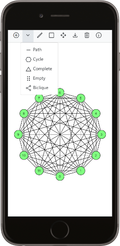
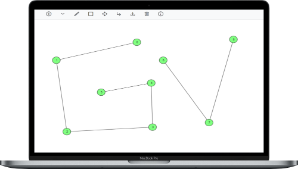

#  GraphViz
A Simple Graph Visualizer for the Web

   

### Features

- Add/Edit Nodes Visually
- Add sub-graphs (Paths,etc)
- Erase Nodes consistently
- Download graphboard as JPG

### TODO

- Add more sub-graphs
- Option to add nodes analytically
- Option for Bezier-Curves for edges
- Release URL
